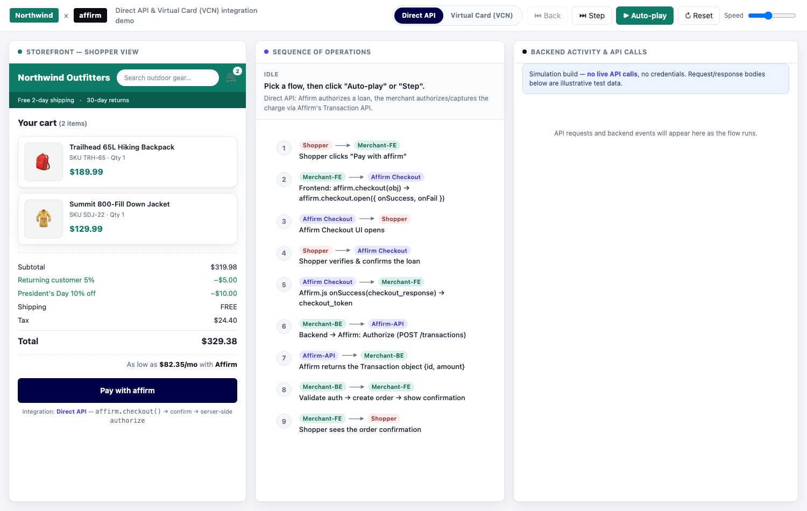

# Affirm Integration Demo — Direct API, VCN &amp; Embedded Checkout

An interactive, **single-file** mockup that walks a merchant through Affirm's
checkout integrations side by side, with a toggle to switch between them. Built
for Affirm Partner Engineering to **reuse per merchant** — rebrand it in ~5
minutes by editing one config block, then share a link or a file.

**Live demo:** https://mahmoudelmarakshy.github.io/affirm-flows-demo/



---

## What it shows

- **Direct API** — `affirm.checkout(obj)` → `affirm.checkout.open({ onSuccess, onFail })`
  → `onSuccess` returns a `checkout_token` → server-side **Authorize**, then
  **Capture / Void / Refund** via the Transaction API (`/api/v1/transactions`).
- **Virtual Card (VCN)** — `affirm.checkout.open_vcn({ success, error, checkout_data })`
  with `use_vcn: true` → `success(card_details)` hands you a one-time virtual
  card you run through your **existing payment processor**.
- **Embedded Checkout** — the same `affirm.checkout()` → `affirm.checkout.open()`
  call as Direct API, but rendered **inline** in the payment section via two
  page elements (`#affirm-embedded-checkout` iframe mount + a
  `#affirm-checkout-confirmation-button` confirmation control) instead of a
  modal or redirect. Settles through the same Authorize/Capture/Void/Refund
  backend as Direct API. Based on a **preliminary, internal** Affirm doc — see
  [`docs/integration-guide-embedded-checkout.md`](docs/integration-guide-embedded-checkout.md).

Three synced columns: a **storefront** (shopper view + back-office order
management), the **sequence of operations**, and a live **backend/API activity
log** with illustrative request/response bodies and links to the relevant Affirm
docs on every call.

Controls: **Auto-play**, **Step** forward, **Back**, click any step in the
sequence to jump to it, and a speed slider.

> **Simulation only.** There are **no live API calls and no credentials** — every
> response is canned, illustrative test data, so the full flow runs anywhere as a
> static page. Sandbox verification pin: `123456`.

---

## Reuse it (the fast path)

### Option A — make it your own copy
1. Click **“Use this template” → Create a new repository** (or fork/clone).
2. Edit the **`DEMO_CONFIG`** block near the top of the `<script>` in
   [`index.html`](index.html).
3. Open `index.html` in a browser to preview. Ship it (see **Deploy** below).

### Option B — just open it
Download `index.html` and double-click it. No server, no build, no install —
great for an offline merchant call.

### Option C — install the Cursor Skill (for the team)
This repo ships a self-contained **Cursor Skill** that teaches the agent to
rebrand, preview, deploy, and extend the demo from plain-English prompts. It
bundles a copy of the template, so it works offline.

```bash
# from a clone of this repo:
cp -R skill/affirm-integration-demo ~/.cursor/skills/
```

Then in Cursor, ask things like *“Rebrand the Affirm demo for Casper — navy
theme, $1,095 mattress, 10% off”* or *“Spin up a new Affirm demo for H&R Block
and deploy it to Pages.”* See [`skill/affirm-integration-demo/`](skill/affirm-integration-demo/)
(`SKILL.md` + `examples.md`) for the full prompt set. A zipped copy is attached
to each [release](https://github.com/mahmoudelmarakshy/affirm-flows-demo/releases).

---

## Customize — the `DEMO_CONFIG` block

All merchant-specific values live in one object. **Prices are in dollars**; the
engine converts to cents and keeps the storefront, the Affirm checkout object,
and the API logs in sync. `subtotal → discounts → tax → total` and the
“as low as” / payment-plan amounts are all **computed** — you never hardcode a
total, so the storefront and the checkout object can’t drift apart.

| Group | Fields | What it controls |
|-------|--------|------------------|
| `brand` | `shortName`, `storeName`, `accent`, `accentDark`, `affirmAccent`, `searchPlaceholder`, `subnav[]` | Header chip, store name, theme colors, nav text |
| `cart.items[]` | `name`, `sku`, `qty`, `price`, `emoji` | Line items + the checkout object `items` |
| `cart.adjustments[]` | `label`, `amount` (neg = discount), `code`, `checkoutName` | Order-summary rows + checkout object `discounts` |
| `cart` | `shipping` (0 = FREE), `tax`, `currency` | Shipping/tax rows + totals math |
| `ids` | `publicApiKey`, `orderId`, `transactionId`, `checkoutToken`, `checkoutId` | Identifiers shown in the logs (merchant `order_id` vs Affirm `id`/loan id) |
| `customer` | `name`, `address`, `phone_number`, `email` | `shipping`/`billing` in the checkout object |
| `card` | `number`, `cvv`, `expiration`, `cardholder_name`, `charge_ari`, `billing_address` | Sample VCN returned by the `success` callback / token exchange |
| `vcnMode` | `'client'` or `'server'` | Default VCN handoff pattern: `client` = `affirm.checkout.open_vcn()` returns the card to the browser `success()` callback; `server` = standard `checkout.open()` → `onSuccess(token)` → backend `POST /checkout/{token}/vcn`. Viewers can also flip this live in the ⚙ Config popover. |
| `travel` | `enabled`, `itinerary{}` | Travel-merchant mode. When on, the checkout object carries the **required** `itinerary` object (`travel_type`, `departure_time`/`arrival_time`, `origin`/`destination`, `passengers[]`) and the log flags it as mandatory. Toggle live in the ⚙ Config popover. See [the Itinerary Object](https://docs.affirm.com/developers/reference/the-itinerary-object). |
| `sandboxPin`, `metadata`, `urls` | — | Verification pin text, checkout `metadata`, Direct API confirm/cancel URLs |

Everything below `DEMO_CONFIG` is the engine — you shouldn’t need to touch it.

---

## Deploy (GitHub Pages)

1. Push your copy to GitHub.
2. **Settings → Pages → Build and deployment → Source: Deploy from a branch**,
   branch `main` / `/ (root)`.
3. Your demo is live at `https://<org-or-user>.github.io/<repo>/` in ~1 minute.

`.nojekyll` is included so Pages serves the file as-is. Any static host
(S3+CloudFront, Netlify, internal static server) works too — it’s one file.

---

## Extend (add a step or a flow)

The engine is a small state machine:

- **`FLOWS.direct` / `FLOWS.vcn`** — ordered arrays of steps. Each step has
  `actors`, a `kind`, a `label`, and a `desc`.
- **`runStep(step)`** — a `switch` on `step.kind` that drives the storefront,
  the modal, and the log (`logApi`, `logEvent`, `logDivider`).
- **`DOCS`** — the Affirm doc links surfaced next to each call; pass `doc: DOCS.x`
  to `logApi` / `logEvent`.

To add a step: add an entry to the flow array and a matching `case` in
`runStep`. To add a flow: add a third key to `FLOWS` and a toggle button.

---

## Reference

- [Affirm checkout overview](https://docs.affirm.com/developers/docs/affirm-checkout-overview)
- [Open Affirm Checkout](https://docs.affirm.com/developers/docs/open-affirm-checkout)
- [Open Affirm Virtual Card Checkout](https://docs.affirm.com/developers/docs/open-affirm-virtual-card-checkout)
- [Managing transactions](https://docs.affirm.com/developers/docs/managing-transactions)

### Authoritative endpoint reference (captured from Affirm's Integration Guide Generator)

These are generated, copy-pasteable integration guides used to keep this demo's
endpoints and payloads accurate:

- [USA — Direct Checkout (Transactions API)](docs/integration-guide-usa-direct.md)
- [USA — Virtual Card (VCN)](docs/integration-guide-usa-vcn.md)
- [Travel vertical — itinerary object (+ insurance)](docs/integration-guide-travel-itinerary.md)
- [Embedded Checkout (preliminary, internal doc)](docs/integration-guide-embedded-checkout.md)

---

_Internal Affirm Partner Engineering asset — simulation/demo use only; contains
no real credentials or PII. Built with Cursor (Claude)._
